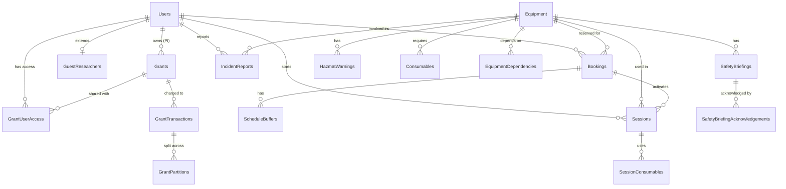

<p align="center">
  <h1 align="center">🔬 LabSync</h1>
  <p align="center">
    <strong>University Laboratory Equipment Booking & Management System</strong>
  </p>
  <p align="center">
    A full-featured web application for managing laboratory equipment reservations, usage sessions, grant billing, safety compliance, and incident reporting in a university research environment.
  </p>
  <p align="center">
    
    
    
    
  </p>
</p>

---

## 📋 Table of Contents

- [Overview](#overview)
- [Features](#features)
- [Architecture](#architecture)
- [Tech Stack](#tech-stack)
- [Getting Started](#getting-started)
- [Project Structure](#project-structure)
- [Database Schema](#database-schema)
- [User Roles & Permissions](#user-roles--permissions)
- [Application Modules](#application-modules)
- [API Routes](#api-routes)
- [Testing](#testing)
- [Demo Accounts](#demo-accounts)
- [Documentation & SRS](#documentation--srs)
- [Design Patterns](#design-patterns)
- [Team](#team)
- [Troubleshooting](#troubleshooting)

---

## Overview

**LabSync** is a comprehensive laboratory management platform built for university research facilities. It digitizes the entire lifecycle of lab equipment usage — from booking and approval, through active usage sessions, to billing and compliance tracking.

The system implements a **two-phase approval workflow** (Lab Manager → PI), **tiered billing** with research grant integration, **safety & compliance enforcement**, and a full **audit trail** for regulatory accountability.

---

## Features

### 🗓️ Equipment Booking & Scheduling
- Browse available lab equipment with real-time status
- Book equipment with automatic time-slot conflict detection
- **Sequential booking dependencies** — booking primary equipment auto-books required secondary equipment (e.g., Mass Spectrometer → Centrifuge)
- **Power-up / cool-down buffer scheduling** to prevent overlapping usage windows
- **Waitlist support** for fully booked equipment
- Cancel bookings with reason tracking

### ⚗️ Session Management
- Start and end real-time usage sessions linked to confirmed bookings
- Track actual usage duration and compute costs
- Log consumable materials used during sessions
- **Calibration tracking** — triggers calibration alerts when equipment exceeds usage thresholds

### 💰 Grant Billing & Financial Management
- Create and manage research grants with budget tracking
- **Tiered rate calculations** — internal, external, and guest researchers have different rate multipliers
- **Overhead cost computation** per equipment
- **Consumable cost deductions** from grant balances
- **Multi-grant partitioning** — split a session cost across multiple grants by percentage
- **Grant reallocation** — transfer funds between grants
- **Hard-cap enforcement** — prevent booking when grant balance is insufficient
- **Grant expiry lockout** — automatically block expired grants

### ✅ Two-Phase Approval Workflow
1. **Phase 1 — Lab Manager Confirmation:** Lab managers review and confirm or reject booking requests
2. **Phase 2 — PI Approval:** Principal Investigators approve financial transactions and billing charges against their grants

### 🛡️ Safety & Compliance
- **Safety briefings** per equipment with mandatory acknowledgement before first use
- **Hazmat warnings** with disposal instructions for hazardous equipment
- **Security clearance levels** — equipment access gated by user clearance
- **Dual-use equipment restrictions** requiring elevated clearance
- **Supervised session requests** for high-risk equipment with PI/Lab Manager approval
- **Guest researcher onboarding** with expiration tracking and auto-lockout
- **Incident reporting** with severity classification and equipment lockout

### 🔒 Admin Panel
- Full user management (create, suspend, activate, update clearance levels)
- Equipment administration (status, rates, maintenance lockout)
- Grant oversight and audit
- **System audit logs** — immutable record of every action with old/new values and IP addresses
- Safety briefing management

---

## Architecture

LabSync is built on a **custom MVC (Model-View-Controller) framework** written from scratch in PHP:

```
                    ┌──────────────┐
                    │   Browser    │
                    └──────┬───────┘
                           │ HTTP Request
                    ┌──────▼───────┐
                    │  .htaccess   │  URL rewriting
                    └──────┬───────┘
                           │
                    ┌──────▼───────┐
                    │  index.php   │  Entry point (front controller)
                    └──────┬───────┘
                           │
                    ┌──────▼───────┐
                    │    Router    │  Pattern matching with {param} support
                    └──────┬───────┘
                           │
              ┌────────────▼────────────┐
              │     BaseController      │  Auth, RBAC, flash messages, audit
              └────────────┬────────────┘
                           │
            ┌──────────────┼──────────────┐
            ▼              ▼              ▼
      ┌──────────┐  ┌──────────┐  ┌──────────────┐
      │  Models  │  │  Modules │  │  Pages/Views │
      │  (Data)  │  │ (Domain  │  │   (HTML/PHP) │
      │          │  │  Logic)  │  │              │
      └────┬─────┘  └──────────┘  └──────────────┘
           │
      ┌────▼─────┐
      │  MySQL   │  Singleton PDO connection
      └──────────┘
```

### Key Architectural Patterns

| Pattern | Implementation |
|---------|---------------|
| **Front Controller** | Single `index.php` entry point with `.htaccess` URL rewriting |
| **MVC** | Controllers (`controllers/`), Models (`models/`), Views (`pages/`) |
| **Singleton** | `Database.php` ensures a single PDO connection instance |
| **Domain Modules** | `modules/` directory encapsulates complex business rules (billing, equipment policies, compliance) |
| **RBAC** | Role-based access enforced via `BaseController::requireRole()` |
| **Flash Messages** | Session-based user feedback system |
| **Audit Trail** | Every state-changing action is logged to `SystemAuditLogs` |

---

## Tech Stack

| Layer | Technology |
|-------|-----------|
| **Language** | PHP 8.3 |
| **Database** | MySQL 8.0 |
| **Web Server** | Apache 2 (with `mod_rewrite`) |
| **Containerization** | Docker & Docker Compose |
| **Testing** | PHPUnit 10 |
| **Frontend** | HTML5, CSS3, Bootstrap (via CDN) |
| **DB Admin** | phpMyAdmin (included in Docker stack) |
| **Dependency Management** | Composer 2 |

---

## Getting Started

### Prerequisites

- [Docker](https://docs.docker.com/get-docker/) & [Docker Compose](https://docs.docker.com/compose/install/)

### Installation

**1. Clone the repository**

```bash
git clone https://github.com/your-username/LabSync-System.git
cd LabSync-System
```

**2. Launch the application**

```bash
docker-compose up -d
```

This starts three containers:

| Service | URL | Port |
|---------|-----|------|
| **LabSync App** | [http://localhost](http://localhost) | `80` |
| **MySQL** | `localhost:3306` | `3306` |
| **phpMyAdmin** | [http://localhost:9988](http://localhost:9988) | `9988` |

The database schema and seed data are automatically loaded on first startup.

**3. Open in browser**

Navigate to [http://localhost/LabSync-System/login](http://localhost/LabSync-System/login) and log in with one of the [demo accounts](#demo-accounts).

### Stopping the application

```bash
docker-compose down
```

> **Note:** Your database data is persisted in a Docker volume (`mysql_data`). To fully reset the database, run:
> ```bash
> docker-compose down -v
> ```

---

## Project Structure

```
LabSync-System/
├── config/
│   └── Database.php              # Singleton PDO database connection
├── controllers/
│   ├── AdminController.php       # Admin panel (users, equipment, grants, logs)
│   ├── AuthController.php        # Login / logout
│   ├── BookingController.php     # Equipment booking & Phase 1 approvals
│   ├── ComplianceController.php  # Safety, hazmat, supervised sessions
│   ├── DashboardController.php   # Role-based dashboard routing
│   ├── EquipmentController.php   # Equipment CRUD & dependencies
│   ├── GrantController.php       # Grant management & reallocation
│   ├── IncidentController.php    # Incident reporting
│   ├── PIController.php          # PI dashboard & Phase 2 approvals
│   ├── ResearcherController.php  # Researcher-specific views
│   └── SessionController.php     # Start/end usage sessions & billing
├── core/
│   ├── App.php                   # Application bootstrap
│   ├── Controller.php            # BaseController (auth, RBAC, helpers)
│   └── Router.php                # Custom URL router with {param} support
├── css/
│   └── style.css                 # Application styles
├── includes/
│   ├── header.php                # Navigation bar (role-aware)
│   └── footer.php                # Page footer with scripts
├── models/                       # Data access layer (PDO queries)
│   ├── AuditLog.php              # System audit log operations
│   ├── BillingManager.php        # Billing calculations
│   ├── Booking.php               # Booking CRUD & conflict detection
│   ├── Consumables.php           # Lab consumables inventory
│   ├── Equipment.php             # Equipment CRUD & status management
│   ├── FacultyPi.php             # PI-specific data queries
│   ├── Grant.php                 # Grant CRUD & balance management
│   ├── GrantTransaction.php      # Financial transaction records
│   ├── GuestResearcher.php       # Guest lifecycle & expiry
│   ├── HazmatWarning.php         # Hazardous material warnings
│   ├── IncidentLog.php           # Incident report records
│   ├── LabManager.php            # Lab manager operations
│   ├── Researcher.php            # Researcher profile & safety status
│   ├── SafetyBriefing.php        # Safety briefing content & acks
│   ├── Session.php               # Usage session tracking
│   └── Users.php                 # User authentication & management
├── modules/                      # Domain-specific business logic
│   ├── billing/                  # 💰 Financial modules
│   │   ├── ConsumableDeduction.php
│   │   ├── GrantExpiryLockOut.php
│   │   ├── GrantHardCap.php
│   │   ├── GrantPartitioning.php
│   │   ├── GrantReallocation.php
│   │   ├── OverheadCalculator.php
│   │   ├── PIApproval.php
│   │   └── RateCalculator.php
│   ├── equipment/                # ⚗️ Equipment policy modules
│   │   ├── BufferScheduler.php
│   │   ├── CalibrationTrigger.php
│   │   ├── HardwareInterLock.php
│   │   ├── MaintenanceLockoutService.php
│   │   ├── OverProvisioningGuard.php
│   │   ├── SafetyGuard.php
│   │   ├── SequentialBooking.php
│   │   └── TieredAccessService.php
│   └── module3/                  # 🛡️ Compliance & safety modules
│       ├── GuestOnboarding.php
│       ├── HazmatWarning.php
│       ├── IncidentLockout.php
│       ├── SecurityClearance.php
│       └── SupervisedSession.php
├── pages/                        # View templates (organized by feature)
│   ├── admin/                    # Admin panel views
│   ├── auth/                     # Login page
│   ├── booking/                  # Booking management views
│   ├── compliance/               # Safety & hazmat views
│   ├── equipment/                # Equipment catalog views
│   ├── grants/                   # Grant management views
│   ├── incidents/                # Incident reporting views
│   ├── PI/                       # PI dashboard views
│   ├── Researcher/               # Researcher dashboard views
│   └── sessions/                 # Active sessions view
├── routes/
│   └── routes.php                # All application route definitions
├── sql/
│   ├── schema.sql                # Database schema (17 tables)
│   └── seed.sql                  # Development seed data
├── tests/
│   ├── bootstrap.php             # Test environment setup
│   ├── BookingFlowTest.php       # Booking workflow tests
│   ├── LoginTest.php             # Authentication tests
│   └── LogoutTest.php            # Logout flow tests
├── docker-compose.yml            # Multi-container Docker setup
├── Dockerfile                    # PHP 8.3 + Apache image
├── composer.json                 # PHP dependencies
└── phpunit.xml                   # Test configuration
```

---

## Database Schema

The system uses **17 relational tables** with full referential integrity:



### Core Tables

| Table | Purpose |
|-------|---------|
| `Users` | All system users with roles, clearance levels, and safety status |
| `GuestResearchers` | Extended profile for guest users (institution, expiry, sponsor PI) |
| `Equipment` | Lab equipment catalog with rates, calibration thresholds, and buffer times |
| `EquipmentDependencies` | Defines primary→secondary equipment relationships for sequential booking |
| `Bookings` | Equipment reservations with multi-status workflow |
| `ScheduleBuffers` | Power-up and cool-down windows around bookings |
| `Sessions` | Actual usage tracking (start/end times, computed costs) |
| `Grants` | Research grants with budgets and expiration dates |
| `GrantUserAccess` | Maps users to grants with billing percentage |
| `GrantTransactions` | Financial records (deductions, refunds, reallocations) |
| `GrantPartitions` | Multi-grant cost splitting records |
| `SafetyBriefings` | Equipment-specific safety instructions |
| `SafetyBriefingAcknowledgements` | User acknowledgement records |
| `HazmatWarnings` | Hazardous material warnings and disposal instructions |
| `IncidentReports` | Safety incident records with severity levels |
| `Consumables` | Lab supplies inventory linked to equipment |
| `SessionConsumables` | Consumables used during a session |
| `SystemAuditLogs` | Immutable audit trail of all system actions |
| `RateTiers` | Billing rate multipliers per user type |
| `ComplianceConfig` | System-wide compliance settings |

---

## User Roles & Permissions

| Role | Key Capabilities |
|------|-----------------|
| **Lab Manager** | Manage equipment, confirm/reject bookings (Phase 1), start/end sessions, file incident reports, manage consumables, view all bookings |
| **Faculty PI** | Manage research grants, approve/reject financial transactions (Phase 2), oversee researchers, approve supervised sessions, sponsor guest researchers |
| **Researcher** | Browse equipment, make bookings, start sessions, view personal grants, acknowledge safety briefings |
| **Guest Researcher** | Same as Researcher but with: time-limited access, higher billing rates, required PI sponsorship, automatic expiry enforcement |

---

## Application Modules

The `modules/` directory contains the core business logic, separated into three domains:

### 💰 Billing Modules (`modules/billing/`)

| Module | Responsibility |
|--------|---------------|
| `RateCalculator` | Computes hourly rates based on user type, external status, and tier multipliers |
| `OverheadCalculator` | Adds equipment-specific overhead percentages to base costs |
| `ConsumableDeduction` | Deducts consumable costs from grant balances and updates inventory |
| `GrantHardCap` | Validates that a grant has sufficient balance before allowing a booking |
| `GrantExpiryLockOut` | Blocks operations against expired grants |
| `GrantPartitioning` | Splits a single cost across multiple grants by percentage |
| `GrantReallocation` | Transfers budget between grants owned by the same PI |
| `PIApproval` | Manages Phase 2 PI approval workflow for financial transactions |

### ⚗️ Equipment Modules (`modules/equipment/`)

| Module | Responsibility |
|--------|---------------|
| `BufferScheduler` | Inserts power-up/cool-down time blocks around bookings |
| `CalibrationTrigger` | Monitors cumulative usage hours and flags equipment for calibration |
| `HardwareInterLock` | Prevents usage of equipment that is locked out or under maintenance |
| `MaintenanceLockoutService` | Manages equipment lockout state and reason tracking |
| `OverProvisioningGuard` | Enforces per-user weekly booking hour limits |
| `SafetyGuard` | Ensures safety briefing acknowledgement before equipment use |
| `SequentialBooking` | Auto-books dependent secondary equipment when primary is booked |
| `TieredAccessService` | Enforces clearance level requirements for equipment access |

### 🛡️ Compliance Modules (`modules/module3/`)

| Module | Responsibility |
|--------|---------------|
| `SecurityClearance` | Validates user clearance against equipment requirements |
| `GuestOnboarding` | Manages guest researcher lifecycle, expiration, and auto-lockout |
| `HazmatWarning` | Displays hazmat alerts and tracks acknowledgements |
| `IncidentLockout` | Locks out equipment and cancels future bookings upon incident filing |
| `SupervisedSession` | Handles supervised session requests and approval workflow |

---

## API Routes

<details>
<summary><strong>Authentication</strong></summary>

| Method | Route | Description |
|--------|-------|-------------|
| `GET` | `/login` | Show login page |
| `POST` | `/login` | Authenticate user |
| `GET` | `/logout` | End session |
| `GET` | `/dashboard` | Role-based dashboard |

</details>

<details>
<summary><strong>Equipment</strong></summary>

| Method | Route | Description |
|--------|-------|-------------|
| `GET` | `/equipment` | List all equipment |
| `GET` | `/equipment/info/{id}` | Equipment detail |
| `GET` | `/equipment/create` | Create form |
| `POST` | `/equipment/store` | Save new equipment |
| `GET` | `/equipment/edit/{id}` | Edit form |
| `POST` | `/equipment/update/{id}` | Update equipment |
| `POST` | `/equipment/delete/{id}` | Delete equipment |
| `POST` | `/equipment/acknowledge` | Acknowledge safety briefing |
| `POST` | `/equipment/dependency/add/{id}` | Add equipment dependency |
| `POST` | `/equipment/dependency/remove/{id}` | Remove equipment dependency |

</details>

<details>
<summary><strong>Bookings</strong></summary>

| Method | Route | Description |
|--------|-------|-------------|
| `GET` | `/bookings` | List bookings |
| `POST` | `/booking/store` | Create booking |
| `POST` | `/booking/cancel/{id}` | Cancel booking |
| `GET` | `/booking/view` | Booking details |
| `POST` | `/booking/confirm/{id}` | Lab Manager confirmation (Phase 1) |

</details>

<details>
<summary><strong>Sessions</strong></summary>

| Method | Route | Description |
|--------|-------|-------------|
| `GET` | `/sessions/active` | View active sessions |
| `POST` | `/sessions/start` | Start a usage session |
| `POST` | `/sessions/end` | End a usage session |

</details>

<details>
<summary><strong>Grants</strong></summary>

| Method | Route | Description |
|--------|-------|-------------|
| `GET` | `/grants` | List grants |
| `GET` | `/grants/add` | Create grant form |
| `POST` | `/grants/store` | Save new grant |
| `GET` | `/grants/assign` | Assign users to grant |
| `POST` | `/grants/processAssign` | Process assignment |
| `GET` | `/grants/manage` | Manage assignments |
| `POST` | `/grants/updateAssignment` | Update assignment |
| `POST` | `/grants/reallocate` | Reallocate funds |
| `POST` | `/grants/delete` | Delete grant |

</details>

<details>
<summary><strong>PI Portal</strong></summary>

| Method | Route | Description |
|--------|-------|-------------|
| `GET` | `/pi` | PI dashboard |
| `GET` | `/pi/requests` | Pending approval requests |
| `GET` | `/pi/users` | View associated users |
| `POST` | `/pi/approve` | Approve transaction |
| `POST` | `/PI/approveBooking` | Approve booking (Phase 2) |
| `POST` | `/PI/rejectBooking` | Reject booking |

</details>

<details>
<summary><strong>Compliance</strong></summary>

| Method | Route | Description |
|--------|-------|-------------|
| `POST` | `/compliance/requestSupervision` | Request supervised session |
| `GET` | `/compliance/pending-supervisions` | View pending requests |
| `POST` | `/compliance/approveSupervision` | Approve supervision |
| `POST` | `/compliance/rejectSupervision` | Reject supervision |
| `GET` | `/compliance/hazmat-alert` | Display hazmat warnings |
| `POST` | `/compliance/acknowledgeWarning` | Acknowledge hazmat warning |

</details>

<details>
<summary><strong>Incidents</strong></summary>

| Method | Route | Description |
|--------|-------|-------------|
| `GET` | `/incidents` | List incidents |
| `GET` | `/incidents/create` | Report form |
| `POST` | `/incidents/store` | File incident report |
| `GET` | `/incidents/{id}` | Incident details |

</details>

<details>
<summary><strong>Admin Panel</strong></summary>

| Method | Route | Description |
|--------|-------|-------------|
| `GET` | `/admin` | Admin dashboard |
| `GET` | `/admin/users` | User management |
| `GET` | `/admin/users/create` | Create user form |
| `POST` | `/admin/users/store` | Save new user |
| `GET` | `/admin/users/{id}` | User details |
| `POST` | `/admin/users/{id}/status` | Update user status |
| `POST` | `/admin/users/{id}/clearance` | Update clearance level |
| `GET` | `/admin/equipment` | Equipment management |
| `GET` | `/admin/equipment/{id}` | Equipment details |
| `POST` | `/admin/equipment/{id}/status` | Update equipment status |
| `POST` | `/admin/equipment/{id}/rate` | Update equipment rate |
| `GET` | `/admin/grants` | Grant overview |
| `GET` | `/admin/grants/{id}` | Grant details |
| `GET` | `/admin/logs` | Audit logs |
| `GET` | `/admin/logs/{id}` | Audit log details |
| `GET` | `/admin/briefings` | Safety briefings |
| `GET` | `/admin/briefings/create` | Create briefing form |
| `POST` | `/admin/briefings/store` | Save new briefing |

</details>

---

## Testing

LabSync uses **PHPUnit 10** for automated testing.

### Run tests inside the Docker container

```bash
docker-compose exec app composer test
```

### Test suite includes

| Test File | Coverage |
|-----------|----------|
| `LoginTest.php` | Authentication flow — valid/invalid credentials, session creation |
| `LogoutTest.php` | Logout flow — session destruction |
| `BookingFlowTest.php` | End-to-end booking workflow — creation, conflict detection, cancellation |

---

## Demo Accounts

The seed data includes pre-configured accounts for testing. **All passwords are:** `password123`

| Username | Role | Notes |
|----------|------|-------|
| `manager_ahmed` | Lab Manager | Full equipment & booking management |
| `pi_smith` | Faculty PI | Grant owner, Phase 2 approvals |
| `researcher_mahmoud` | Researcher | Clearance level 2, internal |
| `researcher_sara` | Researcher | Clearance level 1 (tests access denial) |
| `researcher_external` | Researcher | External, higher billing rates |
| `guest_alice` | Guest Researcher | From MIT, 90-day access |
| `guest_bob_expiring` | Guest Researcher | From Stanford, expires in 5 days |

---

## Documentation & SRS

This project was developed following a complete **software engineering lifecycle** — from initial requirements gathering to final implementation. The full Software Requirements Specification (SRS) document covers every phase of the design process.

📄 **[View the Full SRS Document (Google Docs)](https://docs.google.com/document/d/15n5S8SoD0Dd8cRulOTW83576cCwjCpTQ/edit)**

### Document Structure

The SRS follows **IEEE Std 830-1998** and is organized into two major parts:

#### Part 1 — Requirements Specification

| Section | Contents |
|---------|----------|
| **1. Introduction** | Purpose, project scope, glossary (PI, HAZMAT, RBAC, Interlock, etc.), stakeholder list, and IEEE references |
| **2. Functional Requirements** | 13 user requirements + 30 detailed system requirements across all 3 modules |
| **3. Non-Functional Requirements** | Categorized NFRs covering look-and-feel, usability, performance, maintainability, legal, and security |

#### Part 2 — System Design & Models

| Section | Contents |
|---------|----------|
| **4. Use-Case Diagrams** | Visual use-case models for all actors + 12 detailed use-case descriptions with main/alternate flows |
| **5. Structural & Behavioural Diagrams** | System architecture, activity diagrams, object diagrams, class diagrams, sequence diagrams, communication diagrams, package diagrams, and database specification |

### Functional Requirements Summary

The SRS defines **30 system requirements** organized by the three core modules:

<details>
<summary><strong>Module 1 — Equipment & Access Control (10 requirements)</strong></summary>

| ID | Requirement | Priority |
|----|------------|----------|
| m1-01 | **Multi-State Hardware Interlock** — State machine logic preventing session start unless all preconditions are met | High |
| m1-02 | **Emergency Maintenance Lockout** — Immediate equipment lock with automatic cancellation of future reservations | High |
| m1-03 | **Tiered Access Permissions** — Role-based equipment booking restrictions by clearance level | High |
| m1-04 | **Automated Safety Briefing** — Mandatory safety protocol acknowledgement before session activation | High |
| m1-05 | **Utilization Heatmap Generator** — Visual booking density analysis for administrators | Medium |
| m1-06 | **Sequential Booking Dependency** — Auto-booking of required secondary equipment with primary bookings | Mandatory |
| m1-07 | **Usage-Based Calibration Trigger** — Automatic equipment lockout when usage hours exceed calibration threshold | High |
| m1-08 | **Resource Over-Provisioning Guard** — Per-user weekly booking hour limit enforcement | High |
| m1-09 | **Power-Up/Cool-Down Buffer Scheduler** — Automatic schedule buffer insertion around bookings | Medium |
| m1-10 | **Maintenance Resource Planner** — External technician scheduling without booking conflicts | Medium |

</details>

<details>
<summary><strong>Module 2 — Financials & Billing (10 requirements)</strong></summary>

| ID | Requirement | Priority |
|----|------------|----------|
| m2-01 | **PI's Financial Validation** — Three-option approval workflow (approve/reject/refund) for all transactions | High |
| m2-02 | **Multi-Source Grant Partitioning** — Cost distribution across multiple grants with percentage-based splitting | High |
| m2-03 | **Grant Re-allocation Logic** — Fund transfer between source and destination grants | High |
| m2-04 | **Monthly Invoice Generator** — Automated monthly financial report with transaction history | High |
| m2-05 | **Grant Spending Rate Forecast** — 90-day burn rate analysis with estimated depletion date | High |
| m2-06 | **Consumption-Based Rate Calculator** — Dynamic pricing based on user type (student vs. professor) | High |
| m2-07 | **Grant Hard-Cap Enforcement** — Automatic booking rejection when grant balance is insufficient | High |
| m2-08 | **Consumable Auto-Deduction** — Automatic addition of consumable costs to session billing | High |
| m2-09 | **Indirect Cost (Overhead)** — Administrative overhead percentage applied to final billing | High |
| m2-10 | **Grant Expiry Lockout** — Automatic blocking of expired grants from booking operations | High |

</details>

<details>
<summary><strong>Module 3 — Safety, Compliance & Auditing (10 requirements)</strong></summary>

| ID | Requirement | Priority |
|----|------------|----------|
| m3-01 | **Prerequisite Certification Checker** — Verification of required certifications before booking | High |
| m3-02 | **Certification Expiry Tracker** — Automatic detection of expired user certifications | High |
| m3-03 | **Supervised Session Workflow** — Pending-status approval chain for restricted equipment | High |
| m3-04 | **HAZMAT Alert System** — Hazardous equipment warnings with mandatory acknowledgement | High |
| m3-05 | **Incident Auto-Lockout Workflow** — Automatic account suspension upon incident report submission | High |
| m3-06 | **Admin Provisioning of Guest Accounts** — Temporary account creation with defined expiry dates | High |
| m3-07 | **Guest Account Login & Access Cancellation** — Expiration-based automatic access revocation | High |
| m3-08 | **Security Clearance Verification** — Clearance level validation against equipment requirements | High |
| m3-09 | **Incident Auto-Lockout (Equipment)** — Equipment lockout and future booking cancellation on incident | High |
| m3-10 | **System Audit Trail Logger** — Immutable append-only logging of all database modifications | High |

</details>

### Non-Functional Requirements

| Category | Key Requirements |
|----------|-----------------|
| **Look & Feel** | Visual distinction of restricted/dual-use equipment with warning icons |
| **Usability** | Incident reports completable in <60 seconds; real-time grant balance visualization with color-coded warnings |
| **Performance** | Booking validation pipeline completes in <400ms; auto-lockout executes in <200ms |
| **Maintainability** | Compliance rules isolated in configurable database tables, not hardcoded |
| **Legal** | Banker's rounding for financial compliance; 5-year incident data retention (OSHA) |
| **Security** | Append-only audit logs (0% alterable); automatic session invalidation on guest expiry |

### UML & Design Diagrams

The SRS includes the following diagrams (viewable in the full document):

| Diagram Type | Coverage |
|-------------|----------|
| **Use-Case Diagrams** | All 4 actor types across all 3 modules |
| **Activity Diagrams** | Booking flow, session start, billing pipeline, incident reporting, grant operations |
| **Object Diagrams** | Runtime snapshots of system state for key scenarios |
| **Class Diagrams** | Full domain model with inheritance hierarchies |
| **Sequence Diagrams** | Login, session completion, equipment lockout, booking, quota validation, buffer scheduling, transaction approval |
| **Communication Diagrams** | Object interaction patterns for key workflows |
| **Package Diagrams** | Use-case-based and class-based architectural views |
| **Database Specification** | Complete ER model with all table relationships |

---

## Design Patterns

The system implements four documented design patterns, each solving a specific architectural challenge:

### 🔌 Singleton (Creational) — `Database.php`

**Problem:** Multiple database connections would exhaust MySQL limits and break data integrity across transactions.

**Solution:** A single `Database` class with a private constructor and static `getInstance()` method ensures all 16 model classes share one PDO connection.

```
Database::getInstance()->getConnection()
```

All models (Equipment, Booking, Grant, Session, AuditLog, etc.) consume this single instance.

---

### 📐 Template Method (Behavioral) — User Role Hierarchy

**Problem:** Four user roles share core CRUD behavior but differ in role-specific operations.

**Solution:** An abstract `User` base class defines invariant methods (`createUser()`, `authenticate()`, `updateStatus()`) and declares an abstract `getRole()` method. Concrete subclasses implement their identity and specialized logic.

```
User (abstract)
├── Researcher        → getRole() = 'researcher'
├── GuestResearcher   → getRole() = 'guest_researcher' + expiry logic
├── LabManager        → getRole() = 'lab_manager' + incident/reallocation logic
└── FacultyPI         → getRole() = 'faculty_pi' + transaction approval logic
```

---

### 🔗 Chain of Responsibility (Behavioral) — Booking Validation Pipeline

**Problem:** Booking requests must pass through multiple independent validation gates before approval.

**Solution:** Each gate owns exactly one responsibility and returns a standardized `['success' => bool, 'message' => string]` response. The controller calls each gate sequentially and stops at the first failure.

```
Request → [Security Clearance] → [Safety Briefing] → [Hardware Interlock] → [Over-Provisioning Guard] → ✅ Approved
                 ↓ fail                ↓ fail              ↓ fail                    ↓ fail
              ❌ Denied             ❌ Denied           ❌ Denied                 ❌ Denied
```

| Gate | Handler Class | Validates |
|------|--------------|-----------|
| 1 | `SecurityClearance` | Clearance level & dual-use policy |
| 2 | `SafetyGuard` | Safety briefing acknowledgement |
| 3 | `HardwareInterlock` | Booking window, grant balance, equipment state |
| 4 | `OverProvisioningGuard` | Per-user cumulative hours quota |

---

### 🔒 Immutable Record (Behavioral) — Audit Trail

**Problem:** Audit records must be tamper-evident. If logs could be updated or deleted, compliance and security are compromised.

**Solution:** The `AuditLog` model exposes **only INSERT and SELECT methods** — no `update()` or `delete()` exists. Every state-mutating operation across all controllers calls `$this->logAction()` (inherited from `BaseController`), capturing complete before/after snapshots with `oldValue` (JSON), `newValue` (JSON), IP address, and timestamp.

---

## Team

LabSync was built as a second-year university software engineering project by:

| Member | Role |
|--------|------|
| **Mahmoud Ibrahim** | Team Lead & Developer |
| **Hamza Taha** | Developer |
| **Omar Sedik** | Developer |
| **Ahmed Adel** | Developer |

---

## Troubleshooting

### Port Conflicts

Before launching, ensure ports **80**, **3306**, and **9988** are available:

```bash
sudo ss -tulpn | grep -E ':(80|3306|9988)\b'
```

If a port is in use, stop the conflicting service or modify the port mappings in `docker-compose.yml`.

### Permission Denied (Docker)

If you see "Permission Denied" when running Docker commands:

```bash
# Add your user to the docker group (requires restart)
sudo usermod -aG docker $USER

# Or run with sudo
sudo docker-compose up -d
```

### Database Reset

To completely reset the database and reload seed data:

```bash
docker-compose down -v
docker-compose up -d
```

### Viewing Logs

```bash
# Application logs
docker-compose logs app

# MySQL logs
docker-compose logs mysql

# Follow logs in real-time
docker-compose logs -f
```

---
